#############################################
PyRETIS - analysis of MD flux results
#############################################

Initial flux report generated by PyRETIS version 3.0.3
on 17.04.2026 16:58:32.

The main results are the initial fluxes:

+----------------------------------------------------------------------------------------------------------------------+
|Flux for interfaces                                                                                                   |
+------+----------+--------------+------------+------------+----------+-----------+------------------+-----------------+
| Int. | Position | Flux / units |   Error    | Rel. error |  Ncross  | Neffcross | Neffcross/Ncross | Steps per cross |
+======+==========+==============+============+============+==========+===========+==================+=================+
|  1   | -0.9000  |   0.000000   |    nan     |    nan     |    0     |    0      |       nan        |      inf        |
+------+----------+--------------+------------+------------+----------+-----------+------------------+-----------------+

Detailed results are given below and
the flux results are summarized in the
section on `MD flux data`_.

.. _md-flux-results:

Results from the MD flux analysis
=================================

.. _energy-figures-output:

MD energy data
--------------

Energy and the running average of the energy:

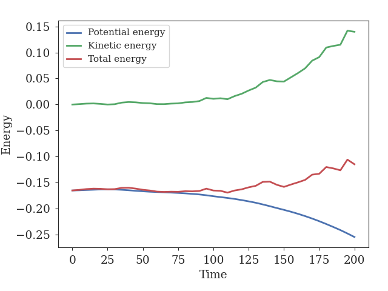
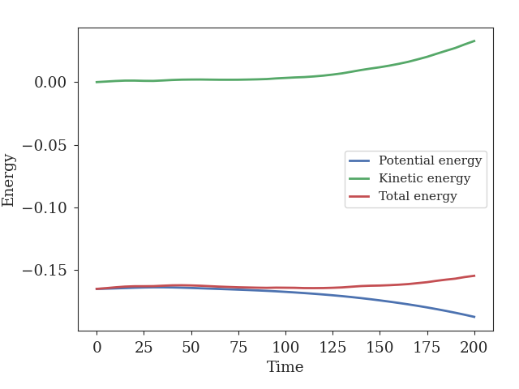

Temperature and the running average of the temperature:

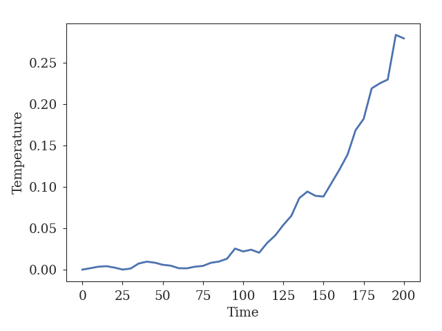
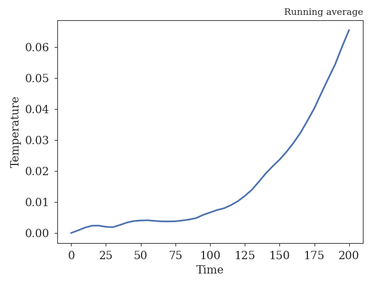

Block error analysis for energies:

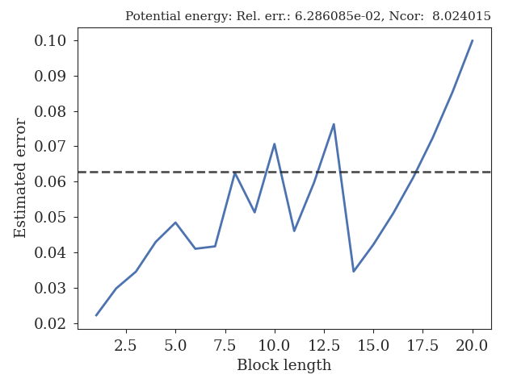
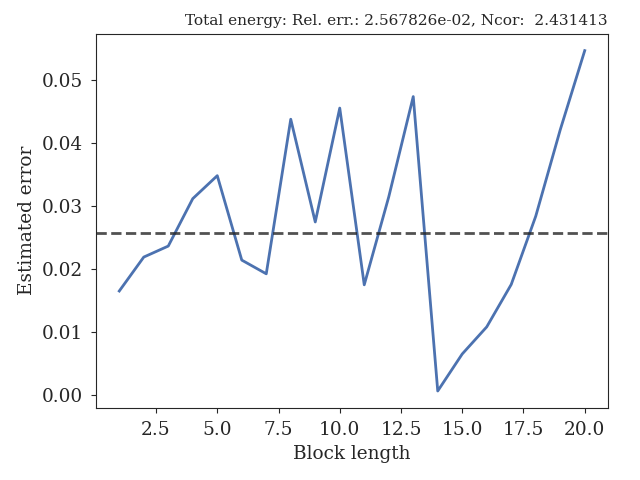

Distribution of energies:

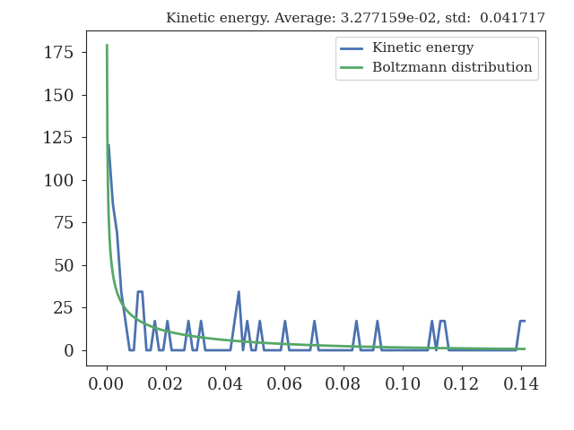
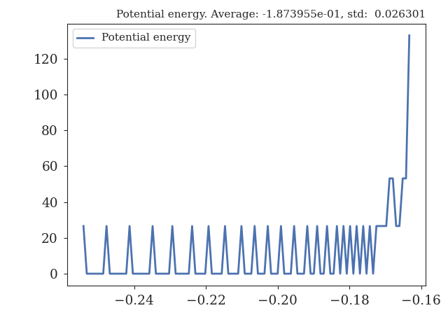
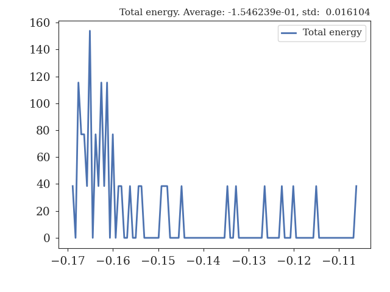

Block error and distribution for temperature:

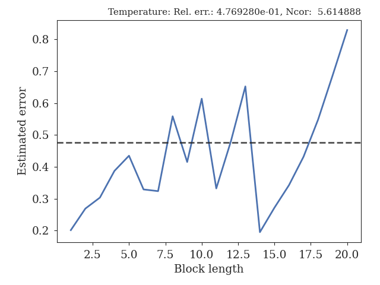
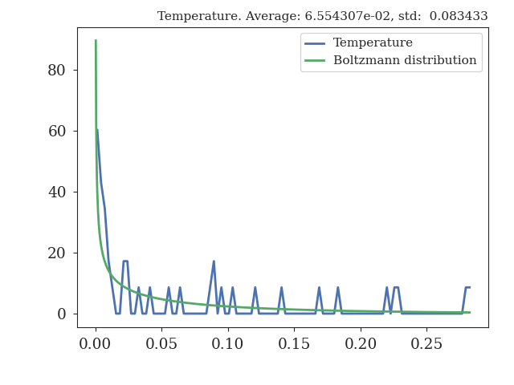

.. _order-figures-output:

MD order parameter data
-----------------------

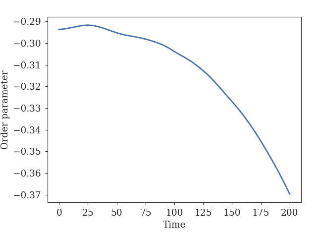
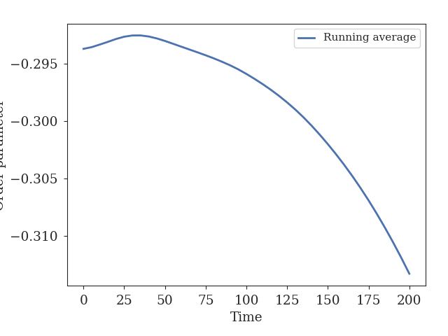
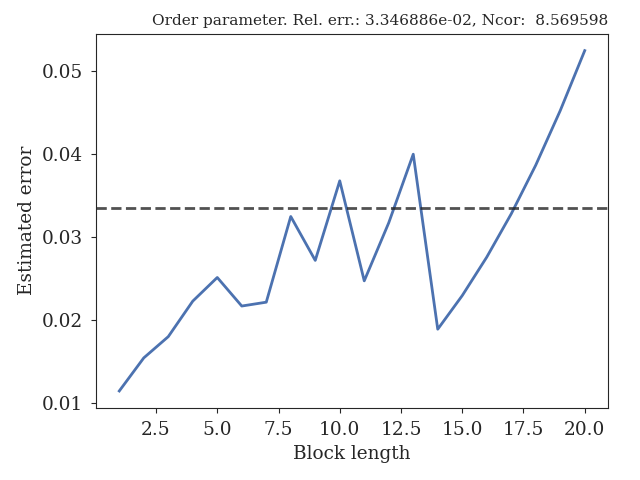

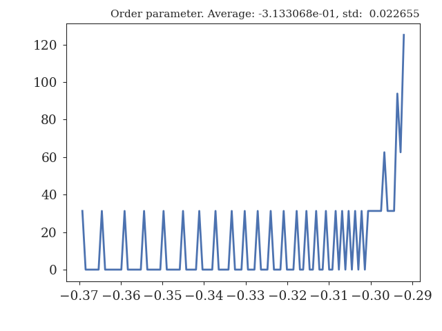
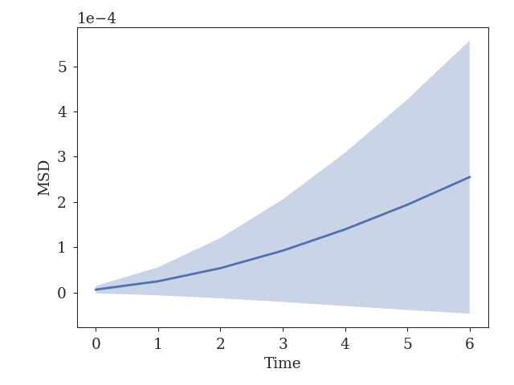

.. _flux-figures-output:

MD flux data
------------

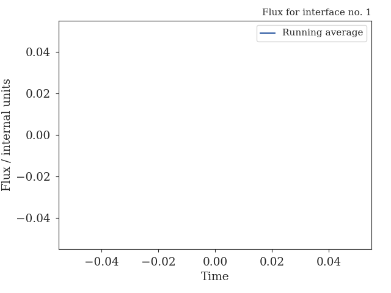
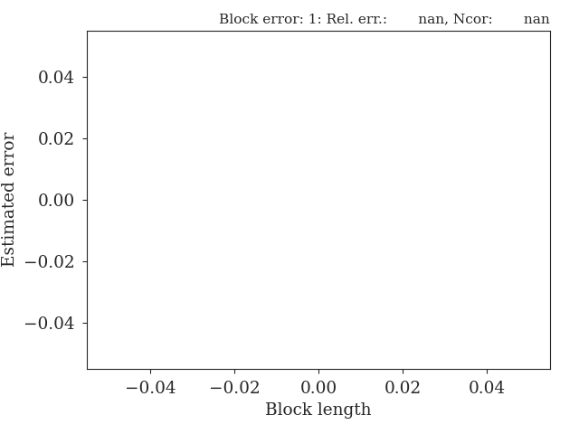

+----------------------------------------------------------------------------------------------------------------------+
|Flux for interfaces                                                                                                   |
+------+----------+--------------+------------+------------+----------+-----------+------------------+-----------------+
| Int. | Position | Flux / units |   Error    | Rel. error |  Ncross  | Neffcross | Neffcross/Ncross | Steps per cross |
+======+==========+==============+============+============+==========+===========+==================+=================+
|  1   | -0.9000  |   0.000000   |    nan     |    nan     |    0     |    0      |       nan        |      inf        |
+------+----------+--------------+------------+------------+----------+-----------+------------------+-----------------+

+-------------------------+
|Cycles spent in state    |
+--------------+----------+
|    State     |  Cycles  |
+==============+==========+
|      A       |      200 |
+--------------+----------+
|      B       |        0 |
+--------------+----------+
|  overall A   |      200 |
+--------------+----------+
|  overall B   |        0 |
+--------------+----------+
| Total cycles |      200 |
+--------------+----------+

+------------------------------------------------------------------------------------------+
|Efficiency                                                                                |
+------------+---------------------+-----------------------+-----------------+-------------+
| Interface  | :math:`p_\text{MD}` | :math:`\frac{1-p}{p}` | Efficiency time | Correlation |
+============+=====================+=======================+=================+=============+
|     1      |      0.000000       |         inf           |      nan        |    nan      |
+------------+---------------------+-----------------------+-----------------+-------------+