################################
PyRETIS - PPRETIS analysis
################################

PPRETIS analysis report generated by PyRETIS version 3.0.3
on 19.04.2026 12:15:24.

The main results are:

* The crossing probability:
  :math:`P_{\text{cross}} = nan  \pm  nan \%`

* The upper estimate of the initial flux (unit: 1/time-unit):
  :math:`f_{A} = 5.384615385e+02  \pm  38.518963075 \%`

* The rate constant (unit: 1/time-unit):
  :math:`k_{AB} = nan  \pm  nan \%`

* Matching factor between the two [0] ensembles:
  :math:`\xi = 1.000000000 \pm 0.000000000e+00 \%`

* The time spent in the reference bin (unit: time-unit / OP-unit):
  :math:`\frac{\tau_{{\mathrm{ref}},[{0^-}{'}]}}{dz} = 0.000000000e+00 \pm nan \%`

* The permeability (unit: OP-unit/ time-unit ):
  :math:`P = nan \pm nan \%`

.. _combined-results:

Combined results
================

The overall matched probability distributions are shown in the left figure
while the matched probability distribution is shown in the right figure below.
The overall crossing rate as a function of cycles
and its relative error block analysis are reported in the two following
plots, respectively.

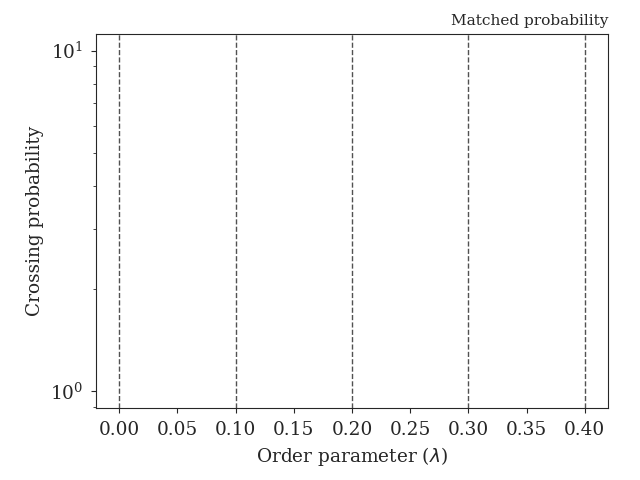
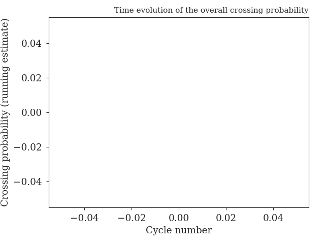
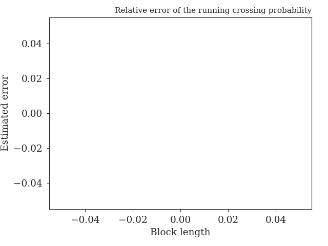

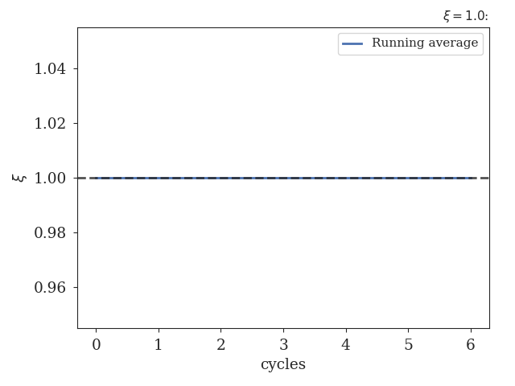
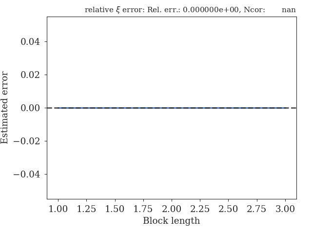
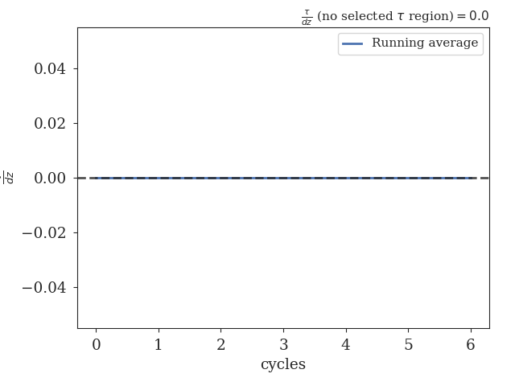
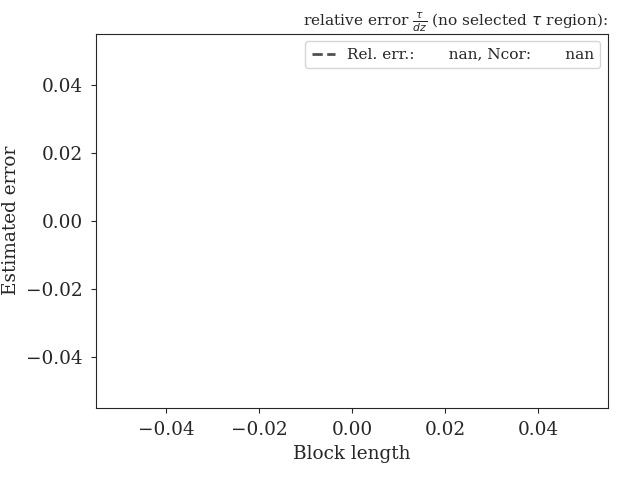
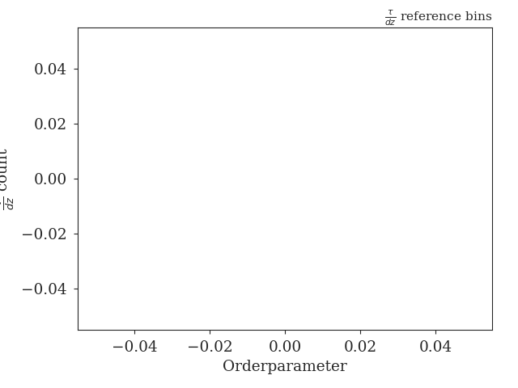

.. _figure-results:

Results for path ensembles
==========================

The following interfaces were used in the simulation (and analysis)
for calculating the crossing probabilities:

+-------------------------------------------+
|Interfaces                                 |
+----------+----------+----------+----------+
| Ensemble |   Left   |  Middle  |  Detect  |
+==========+==========+==========+==========+
|  [0^-]   | -0.1000  |  0.0000  |  0.0000  |
+----------+----------+----------+----------+
|  [0^+]   |  0.0000  |  0.0000  |  0.1000  |
+----------+----------+----------+----------+
|  [1^+]   |  0.0000  |  0.1000  |  0.2000  |
+----------+----------+----------+----------+
|  [2^+]   |  0.1000  |  0.2000  |  0.3000  |
+----------+----------+----------+----------+
|  [3^+]   |  0.2000  |  0.3000  |  0.4000  |
+----------+----------+----------+----------+

+------------------------------------------------------------------+
|Probabilities                                                     |
+----------+------------+------------+------------+----------------+
| Ensemble | Pcross pm  | Pcross mp  |   Error    | Rel. error (%) |
+==========+============+============+============+================+
|  [0^+]   |  0.000000  |  0.000000  |  0.000000  |    0.000000    |
+----------+------------+------------+------------+----------------+
|  [1^+]   |  0.000000  |  0.000000  |  0.000000  |    0.000000    |
+----------+------------+------------+------------+----------------+
|  [2^+]   |  1.000000  |  0.000000  |  0.000000  |    0.000000    |
+----------+------------+------------+------------+----------------+
|  [3^+]   |  0.666667  |  0.000000  |  0.333333  |      nan       |
+----------+------------+------------+------------+----------------+

+-------------------------------------------------------------------------------+
|Pathensemble data                                                              |
+----------+------------+------------------+-----------------+------------------+
| Ensemble | TIS cycles | Shoot acc. ratio | Swap acc. ratio | Avg. path length |
+==========+============+==================+=================+==================+
|  [0^-]   |     7      |     0.500000     |    1.000000     |     3.285714     |
+----------+------------+------------------+-----------------+------------------+
|  [0^+]   |     9      |     0.400000     |    0.250000     |    10.000000     |
+----------+------------+------------------+-----------------+------------------+
|  [1^+]   |     6      |     0.750000     |    0.000000     |    123.833333    |
+----------+------------+------------------+-----------------+------------------+
|  [2^+]   |     12     |     0.333333     |    0.500000     |    164.750000    |
+----------+------------+------------------+-----------------+------------------+
|  [3^+]   |     4      |     1.000000     |    0.500000     |    559.250000    |
+----------+------------+------------------+-----------------+------------------+

.. _prob-figures-output:

Crossing probabilities
----------------------

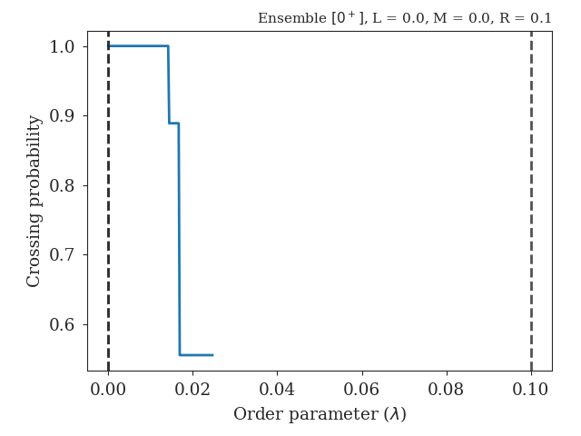
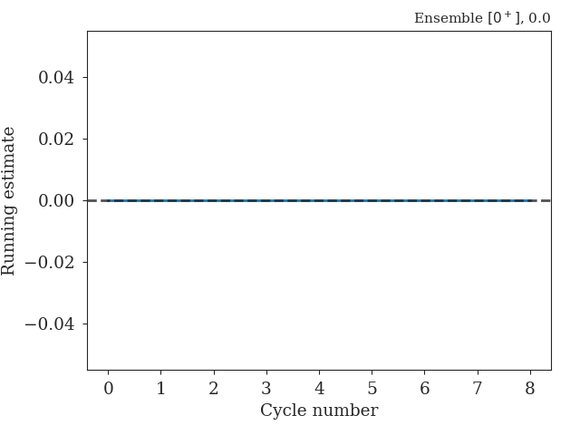

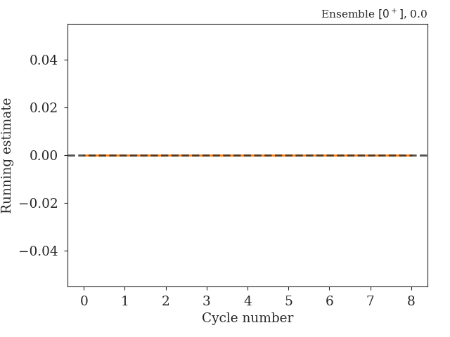
.. image:: 001_perror_sr.png
   :width: 30%

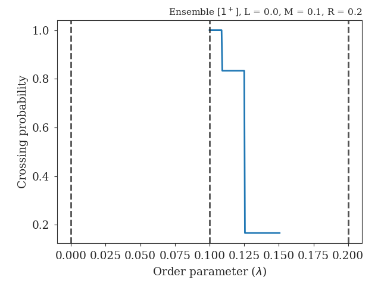
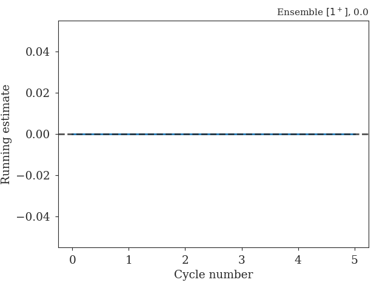
.. image:: 002_perror_sl.png
   :width: 30%

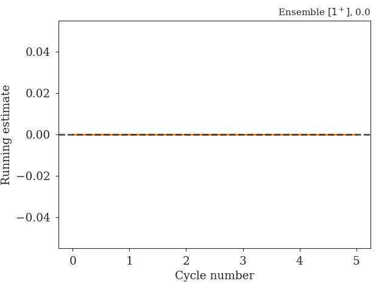

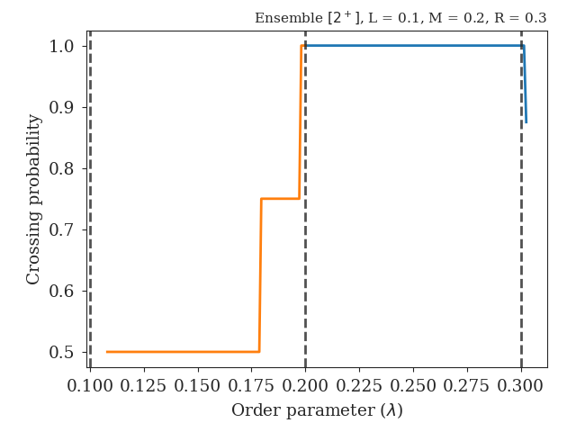
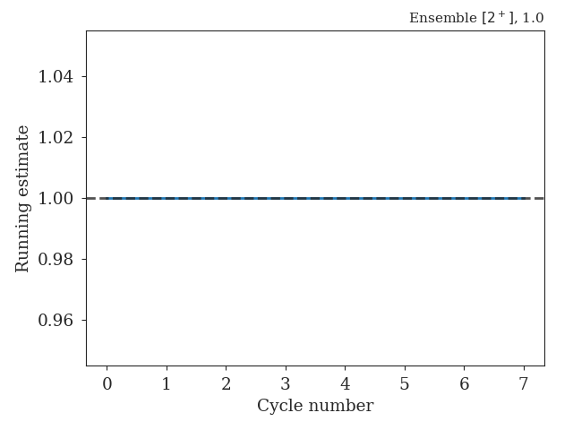
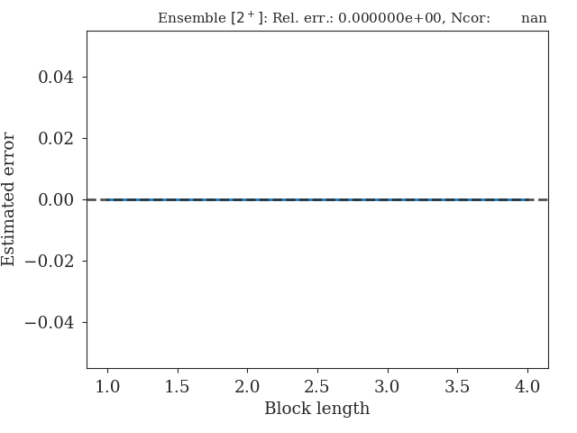

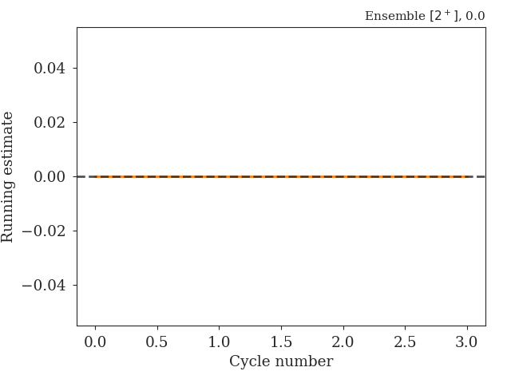
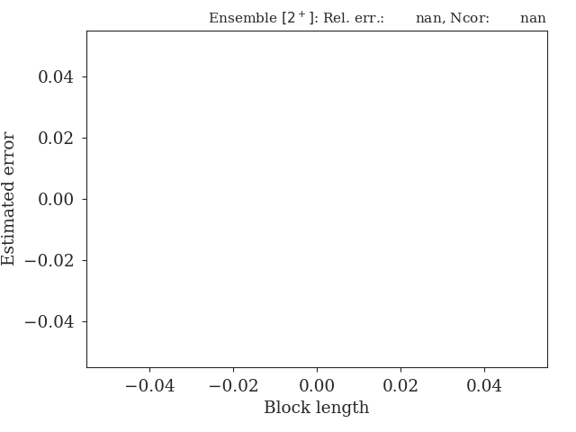

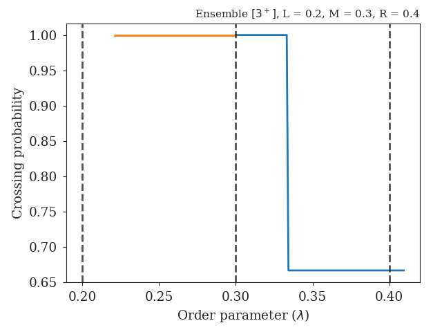
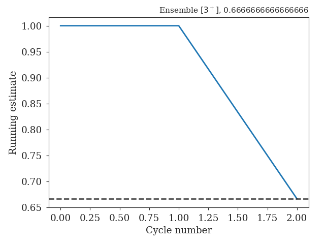
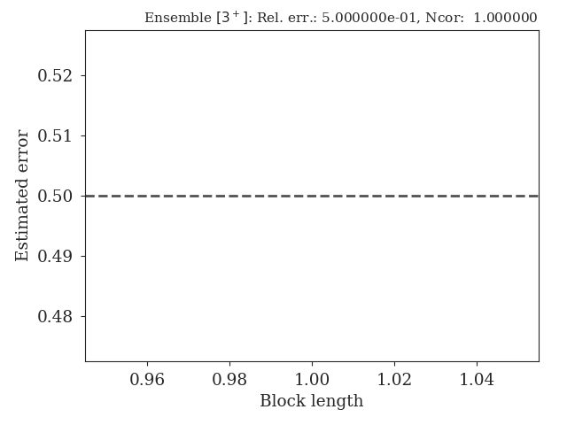

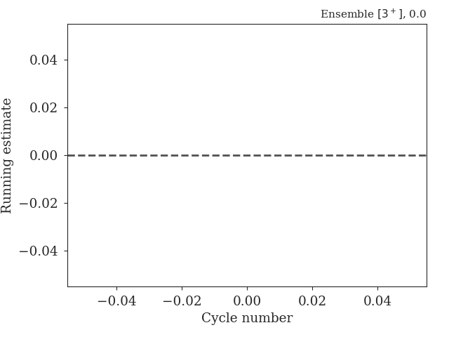

.. _len-shoot-figures-output:

Distributions for path lengths and shooting moves
-------------------------------------------------

The average path lengths in the different ensembles are given in
the table below and some distributions for the path lengths and
shooting moves can also be found here:

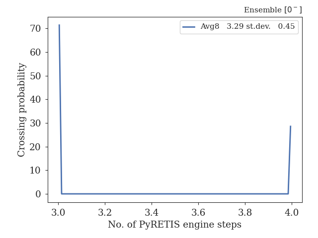
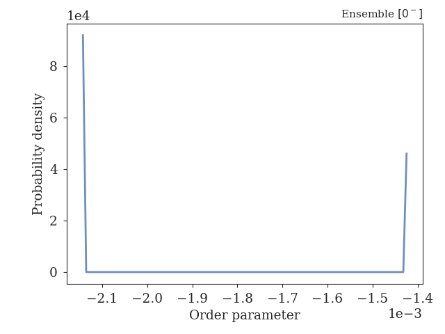

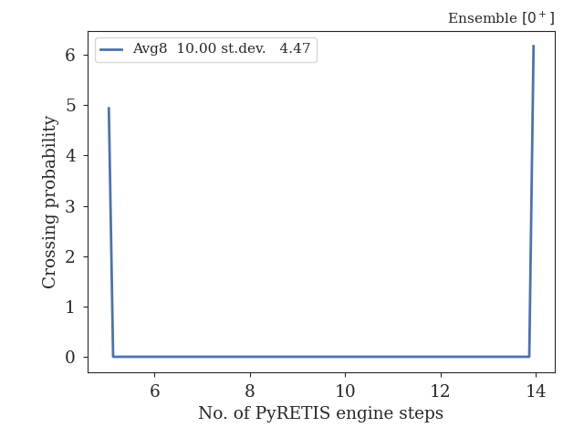
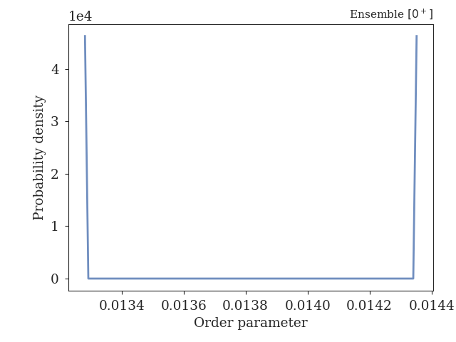

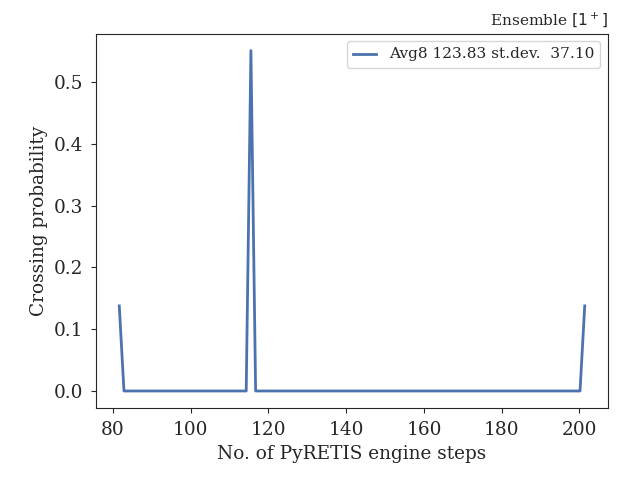
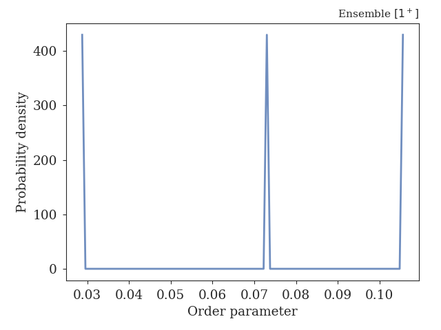

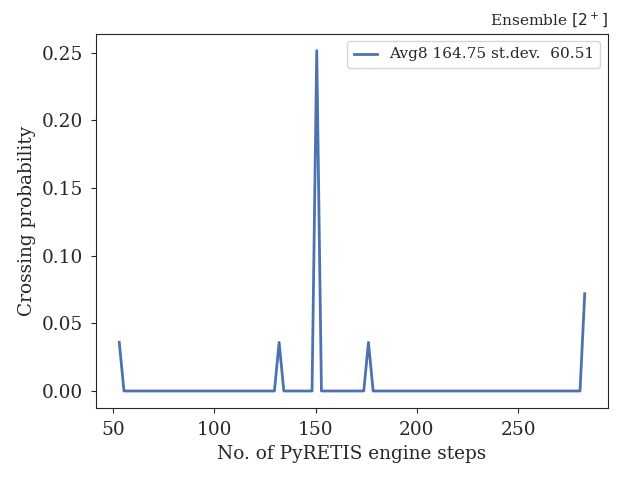
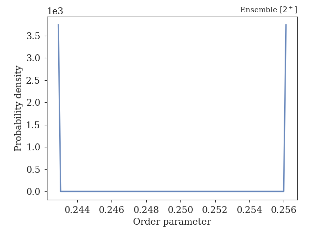

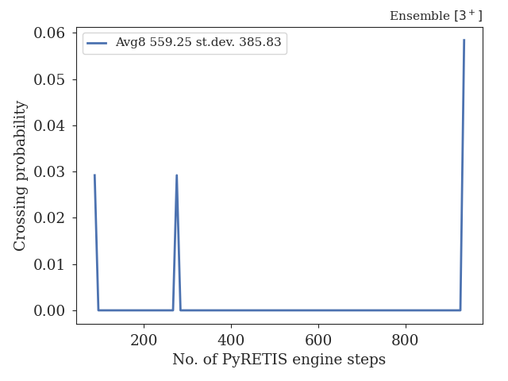
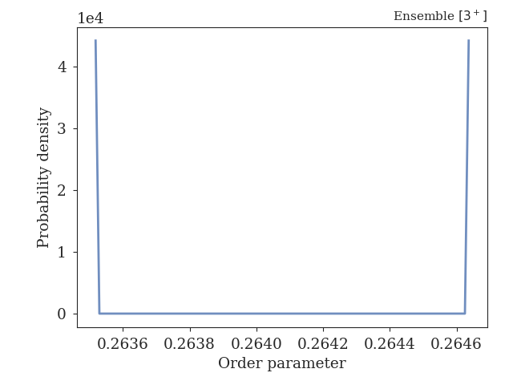

