################################
PyRETIS - RETIS analysis
################################

RETIS analysis report generated by PyRETIS version 3.0.3
on 19.04.2026 12:17:26.

The main results are:

* The crossing probability:
  :math:`P_{\text{cross}} = 0.272727273  \pm  51.021677634 \%`

* The initial flux (unit: 1/reduced):
  :math:`f_{A} = 0.349428208  \pm  14.058239175 \%`

* The rate constant (unit: 1/reduced):
  :math:`k_{AB} = 9.529860229e-02  \pm  52.923016517 \%`

.. _combined-results:

Combined results
================

The overall matched probability distributions are shown in the left figure
while the matched probability distribution is shown in the right figure below.
The overall crossing rate as a function of cycles
and its relative error block analysis are reported in the two following
plots, respectively.

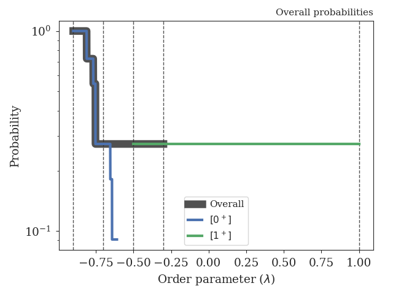

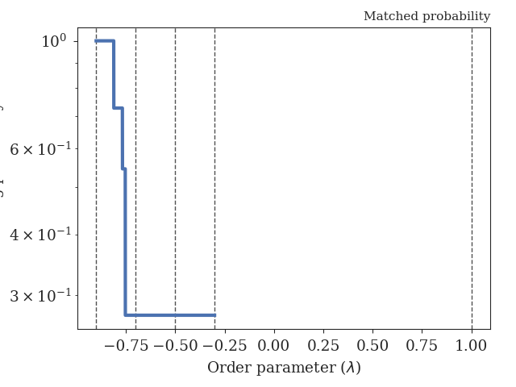

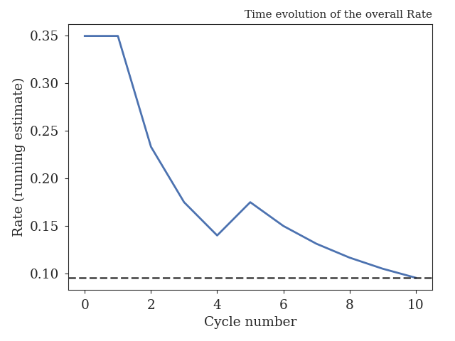

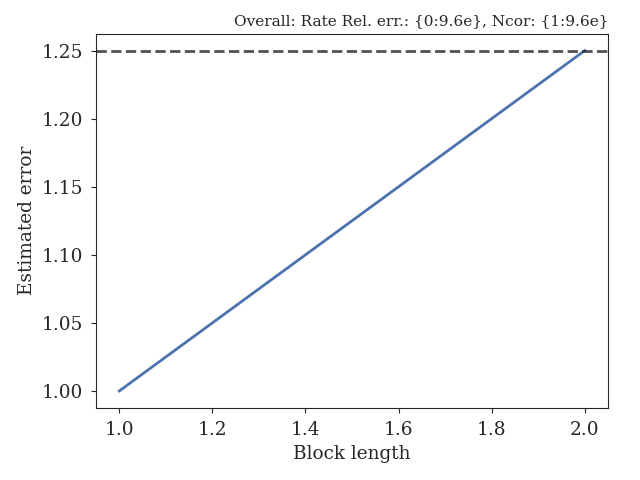

.. _figure-results:

Results for path ensembles
==========================

The following interfaces were used in the simulation (and analysis)
for calculating the crossing probabilities:

+-------------------------------------------+
|Interfaces                                 |
+----------+----------+----------+----------+
| Ensemble |   Left   |  Middle  |  Detect  |
+==========+==========+==========+==========+
|  [0^-]   |   -inf   | -0.9000  |          |
+----------+----------+----------+----------+
|  [0^+]   | -0.9000  | -0.9000  | -0.7000  |
+----------+----------+----------+----------+
|  [1^+]   | -0.9000  | -0.7000  | -0.5000  |
+----------+----------+----------+----------+
|  [2^+]   | -0.9000  | -0.5000  | -0.3000  |
+----------+----------+----------+----------+
|  [3^+]   | -0.9000  | -0.3000  |  1.0000  |
+----------+----------+----------+----------+

+-----------------------------------------------------+
|Crossing probabilities                               |
+----------+------------+------------+----------------+
| Ensemble |   Pcross   |   Error    | Rel. error (%) |
+==========+============+============+================+
|  [0^+]   |  0.272727  |  0.139150  |   51.021678    |
+----------+------------+------------+----------------+
|  [2^+]   |  1.000000  |  0.000000  |    0.000000    |
+----------+------------+------------+----------------+

+-------------------------------------------------------------------------------+
|Pathensemble data                                                              |
+----------+------------+------------------+-----------------+------------------+
| Ensemble | TIS cycles | Shoot acc. ratio | Swap acc. ratio | Avg. path length |
+==========+============+==================+=================+==================+
|  [0^-]   |     14     |     1.000000     |    1.000000     |    97.000000     |
+----------+------------+------------------+-----------------+------------------+
|  [0^+]   |     11     |     1.000000     |    0.666667     |    50.090909     |
+----------+------------+------------------+-----------------+------------------+
|  [2^+]   |     14     |     0.166667     |    0.500000     |    95.000000     |
+----------+------------+------------------+-----------------+------------------+

.. _prob-figures-output:

Crossing probabilities
----------------------

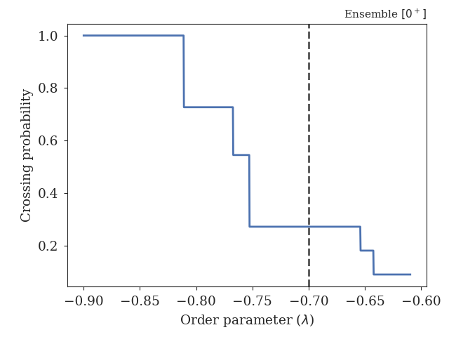

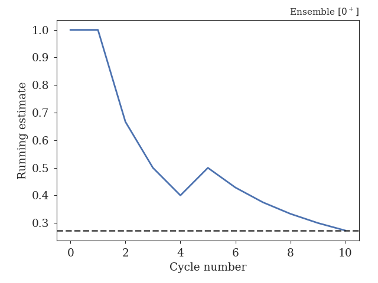

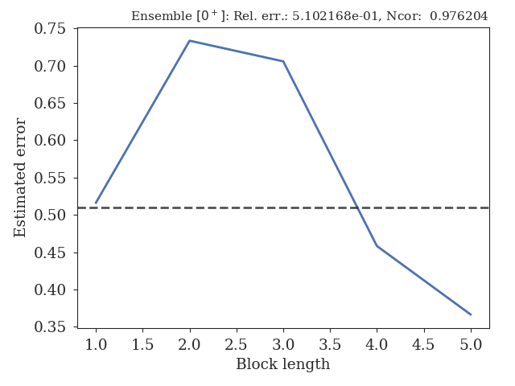

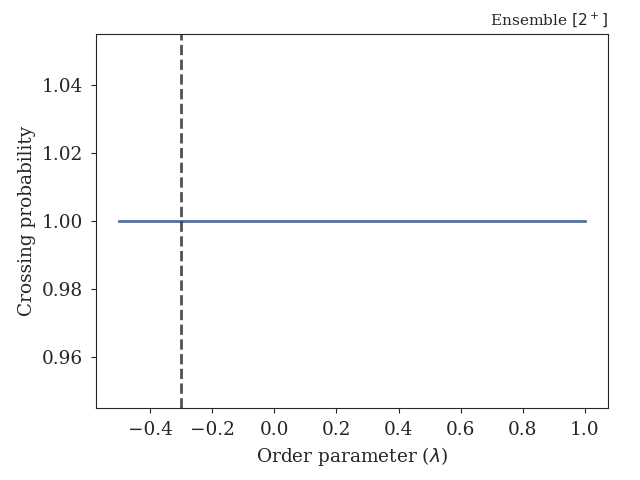

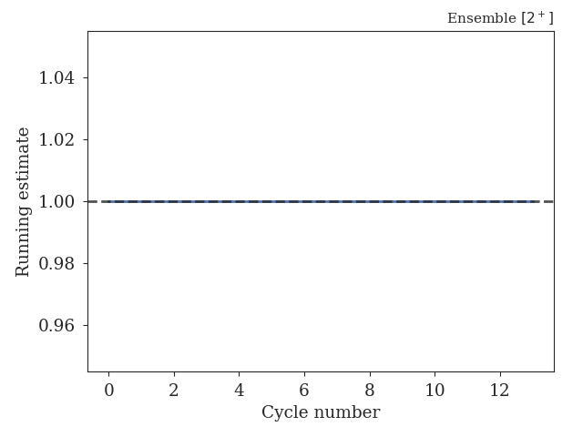

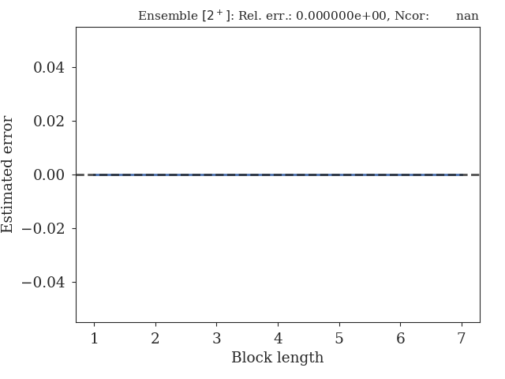

.. _len-shoot-figures-output:

Distributions for path lengths and shooting moves
-------------------------------------------------

The average path lengths in the different ensembles are given in
the table below and some distributions for the path lengths and
shooting moves can also be found here:

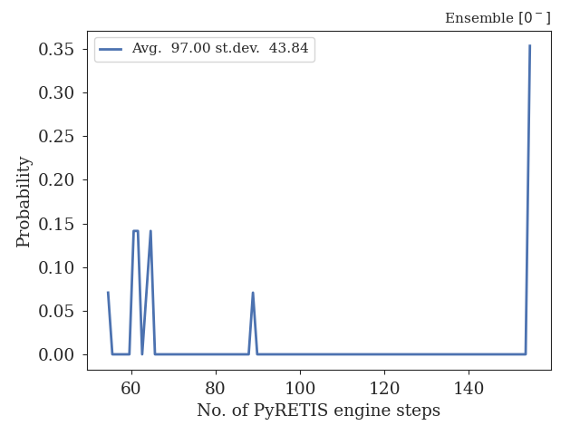

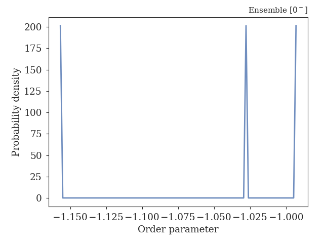

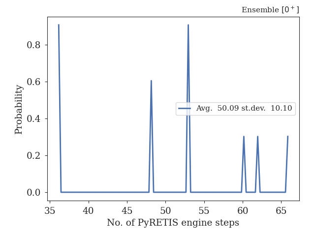

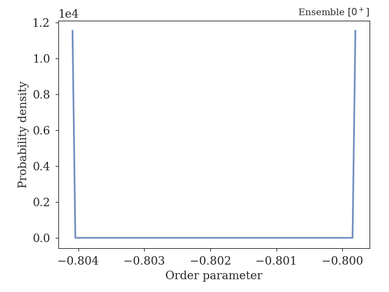

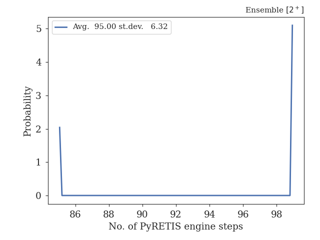

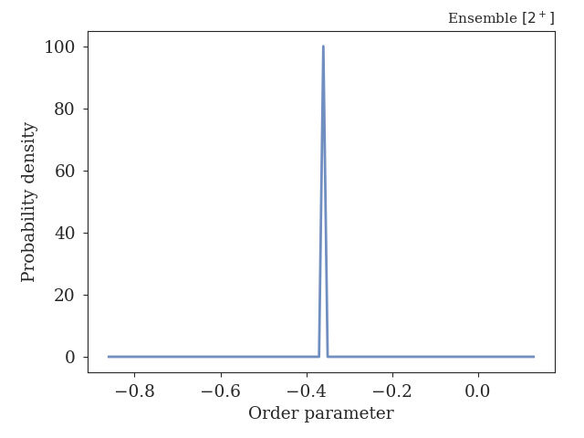

